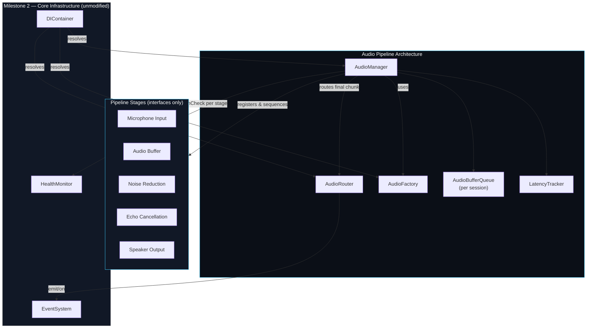
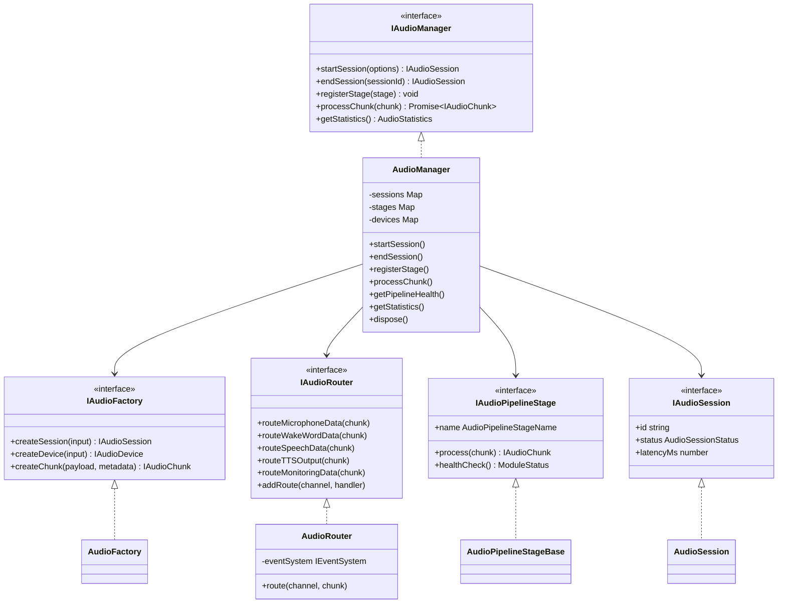
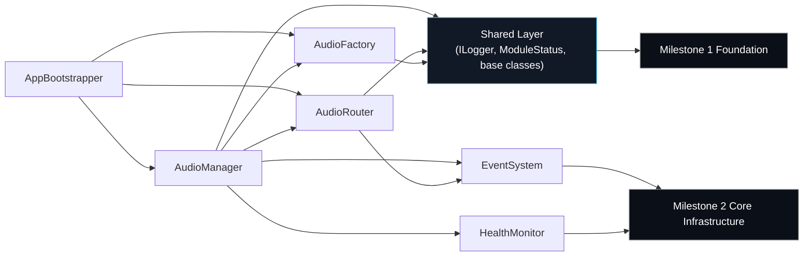
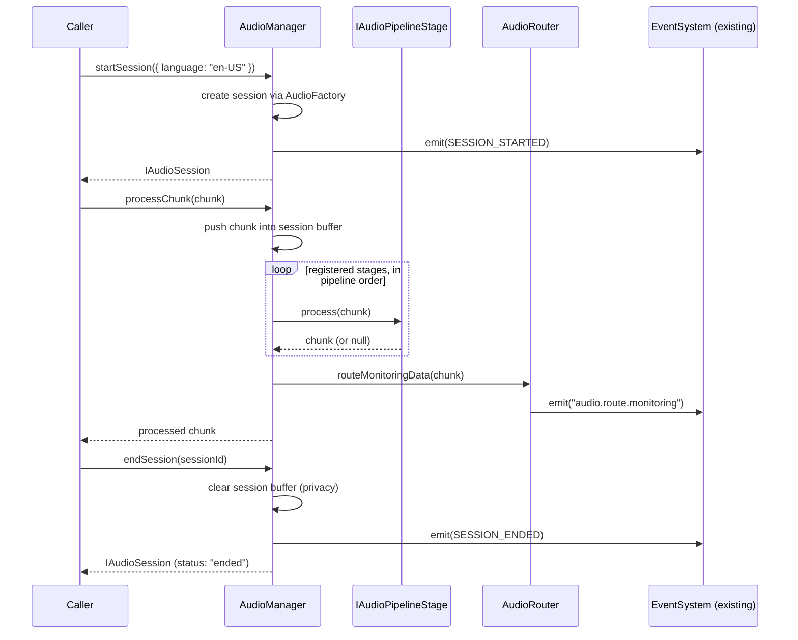

# Audio Pipeline Architecture

> **Status:** architecture only. No microphone capture, no audio
> recording, no Speech-to-Text, no Text-to-Speech, no wake-word engine,
> and no AI Brain exist anywhere in this milestone. Every class below
> either orchestrates/routes structural data or is a pure interface a
> future provider will implement.

## Note on prior milestones

This milestone's instructions describe Milestone 3.1 (Voice Provider
Architecture), 3.2 (Speech-to-Text Architecture), and 3.3 (Wake Word
Architecture) as already "LOCKED." The project actually supplied to
build on top of contains only Milestone 1 (Project Foundation) and
Milestone 2 (Core Infrastructure) — `app/voice/` is still the plain
Milestone 1 placeholder (`README.md` / `index.ts` / `types.ts`, no
implementation). Rather than inventing content for milestones that
weren't present, this Audio Pipeline Architecture was built directly on
the verified Milestone 1 + 2 foundation, preserving every existing
module exactly. If 3.1–3.3 exist elsewhere, they were not included in
the uploaded project and so could not be extended here.

## Placement decision

Following the precedent set in Milestone 2 (Communication Bus and Agent
Manager live in `app/backend/src/infrastructure/`, not inside the
`app/communication` / `app/agents` placeholders), the Audio Pipeline
Architecture lives in `app/backend/src/audio/`. `app/voice/` is left
completely untouched — no rename, no move, no content change — reserved
for a future milestone's concrete voice provider implementation.

```
app/backend/src/audio/
├── types/            AudioDeviceType, AudioConnectionType, AudioSessionStatus,
│                      AudioPipelineStageName, AudioFormat
├── errors/            AudioError hierarchy (extends Milestone 1's AppError)
├── interfaces/         IAudioChunk, IAudioDevice, IAudioSession,
│                      IAudioPipelineStage, IAudioRouter, IAudioManager, IAudioFactory
├── models/            AudioSession, AudioDevice (concrete, data-only)
├── buffer/            AudioBufferQueue (bounded, in-memory-only FIFO)
├── metrics/           LatencyTracker
├── pipeline/
│   ├── stages/         marker interfaces for all eight pipeline stages
│   └── AudioPipelineStageBase.ts   reusable pass-through base class
├── events/            AUDIO_EVENTS catalog (session/device/stage lifecycle)
├── channels/           AUDIO_CHANNELS catalog (the five required data routes)
├── AudioManagerConfig.ts
├── AudioRouter.ts
├── AudioFactory.ts
├── AudioManager.ts
└── tokens.ts           AUDIO_TOKENS (DI Container injection tokens)
```

## The Pipeline

The milestone architects, in this order, exactly the eight stages
requested:

1. **Microphone Input** — `IMicrophoneInputStage` (interface only)
2. **Audio Buffer** — `IAudioBufferStage` (interface) + the concrete,
   generic `AudioBufferQueue`
3. **Noise Reduction** — `INoiseReductionStage` (interface only)
4. **Echo Cancellation** — `IEchoCancellationStage` (interface only)
5. **Wake Word Routing** — `AudioRouter.routeWakeWordData()`
6. **Speech-to-Text Routing** — `AudioRouter.routeSpeechData()`
7. **Voice Output Routing** — `AudioRouter.routeTTSOutput()`
8. **Speaker Output** — `ISpeakerOutputStage` (interface only)

`AudioPipelineStageName` (`shared` — really `audio/types/`) fixes this
as the canonical processing order; `AudioManager.processChunk()` runs
every *registered* stage in this order via `AudioPipelineStageBase`'s
default pass-through `process()`. No concrete stage with real DSP, ML,
or hardware logic is implemented — tests register trivial pass-through
mocks to prove the orchestration works end to end.

Session control, error handling, audio metadata, and latency tracking —
the four cross-cutting concerns listed alongside the eight stages — are
covered by `AudioSession` (session control + metadata), the `AudioError`
hierarchy (error handling), `IAudioChunkMetadata` (per-chunk metadata:
`sessionId`, `sequence`, `capturedAt`, `format`, optional `tags`), and
`LatencyTracker` + `AudioSession.latencyMs` (latency tracking).

## AudioManager

`AudioManager` is the orchestrator. Per the spec, it is responsible for:

| Responsibility | Method(s) |
|---|---|
| Session lifecycle | `startSession`, `endSession`, `getSession`, `listSessions` |
| Device management | `registerDevice`, `unregisterDevice`, `listDevices`, `getDefaultDevice`, `setDefaultDevice` |
| Pipeline orchestration | `registerStage`, `unregisterStage`, `listStages`, `processChunk` |
| Buffer management | a private `AudioBufferQueue` per active session, cleared on `endSession` and on `dispose()` |
| Pipeline health | `getPipelineHealth()`, backed by the *existing* Health Monitor |
| Statistics | `getStatistics()` — sessions started/ended, active sessions, chunks processed, average latency |
| Configuration | `AudioManagerConfig` (buffer capacity, max concurrent sessions), sourced only from the Configuration Manager |

**AudioManager never contains provider-specific logic.** It holds
`IAudioPipelineStage` implementations and calls their `process()` /
`healthCheck()` — it has no knowledge of a real microphone, codec, noise
model, or speech engine, because none exist yet.

## AudioRouter

`AudioRouter` routes audio chunks between pipeline participants. It is a
thin, named wrapper around the **existing** Event System (Milestone 2) —
the same pattern `IpcRouter` uses over Electron's `ipcMain` in Milestone
1. No new transport mechanism is introduced. See
[`AUDIO_ROUTING_GUIDE.md`](./AUDIO_ROUTING_GUIDE.md) for full detail.

## AudioSession

`AudioSession` (concrete model, implementing `IAudioSession`) is a plain
data object: session ID, input/output device IDs, language, start/end
time, latency, status, and free-form metadata. It **never** holds an
audio payload. See
[`AUDIO_SESSION_GUIDE.md`](./AUDIO_SESSION_GUIDE.md) for the full field
reference and the privacy guarantees around it.

## Audio Devices

`IAudioDevice` / `AudioDevice` describe a microphone or speaker: id,
name, `type` (`input`/`output`), `connection`
(`builtin`/`usb`/`bluetooth`/`virtual`), `isDefault`, and
`supportedFormats`. `AudioManager` holds an in-memory device registry
(`registerDevice`/`unregisterDevice`/`listDevices`/`setDefaultDevice`)
and emits `AUDIO_EVENTS.DEVICE_REGISTERED` /
`DEFAULT_DEVICE_CHANGED` through the Event System — this is the
attachment point a future hot-plug-detection provider would call into.
**No hardware or device SDK is implemented.**

## Performance & Privacy preparation

- **Low latency / streaming** — `AudioBufferQueue` is a bounded FIFO
  (oldest item evicted once full) rather than an unbounded array, so
  buffering never grows without limit; `LatencyTracker` gives
  `AudioManager` a rolling average/min/max ready for a future streaming
  provider to report against.
- **Buffer optimization** — buffer capacity is configurable
  (`AppConfig.audio.bufferCapacity`), not hardcoded, so a future provider
  can tune it per device/format without code changes.
- **Hardware acceleration** — deliberately not addressed at the code
  level in this milestone; see the ADR in
  [`AUDIO_PIPELINE_ARCHITECTURE.md`](#adr-audio-002-no-hardware-acceleration-hook-yet) below.
- **Privacy** — no audio payload is ever written to disk. Buffers are
  in-memory only, bounded, and explicitly `clear()`-ed when a session
  ends and when `AudioManager.dispose()` runs. `AudioChunk.payload` is a
  transient `Uint8Array` that only ever lives in the process's memory
  for the duration it takes to pass through registered stages.

## Dependency Injection

`AudioManager`, `AudioRouter`, and `AudioFactory` are registered as
singletons into the **same** `DIContainer` instance created in
Milestone 2's `AppBootstrapper` (see `audio/tokens.ts` for the
`InjectionToken`s). `DIContainer.ts` itself is not modified — only new
`container.register(...)` calls were added, the identical mechanism
already used for `CommunicationBus`, `EventSystem`, etc.

## Logging & Configuration

Every audio class takes `ILogger` through its constructor and never
calls `console.*`. `AppConfig.audio` was added to the Configuration
Manager's schema (`sampleRateHz`, `channels`, `bitDepth`,
`bufferCapacity`, `maxConcurrentSessions`, `defaultLanguage`,
`noiseReductionEnabled`, `echoCancellationEnabled`) following the exact
same `defaults -> config file -> env var` precedence `ConfigManager`
already implements — its class/precedence logic itself is unmodified,
only the schema was extended, the same way Milestone 2 added its
`infrastructure` section.

## Diagrams

### Architecture Diagram



### Class Diagram



### Dependency Diagram



### Sequence Diagram



## Architecture Decision Records

### ADR-AUDIO-001: Reuse the Event System instead of a new audio transport

**Decision:** `AudioRouter` is implemented entirely on top of the
existing `IEventSystem` (Milestone 2), rather than introducing a new
pub/sub mechanism for audio data.

**Rationale:** The instructions require the Audio Pipeline to extend,
not redesign, the locked architecture, and explicitly forbid modifying
Dependency Injection or introducing parallel infrastructure. Audio
chunks are fire-and-forget, categorized data — exactly what
`IEventSystem` already models (it has no response/timeout/retry
semantics to fight against, unlike `ICommunicationBus`). Reusing it also
means `AudioRouter`'s priority ordering, error isolation, and dispatch
logic are already tested (Milestone 2's 38 tests) instead of duplicated.

**Alternatives considered:** A dedicated `AudioBus` mirroring
`CommunicationBus`. Rejected — it would duplicate priority-queue and
dispatch logic that the Event System already provides, for no
behavioral gain at this architecture-only stage.

**Consequences:** If a future milestone needs command/response semantics
for audio (e.g., "start capture and wait for hardware ack"), that
belongs on `ICommunicationBus`, not `AudioRouter` — `AudioRouter` should
stay pure pub/sub.

### ADR-AUDIO-002: No hardware-acceleration hook yet

**Decision:** No interface or extension point for hardware-accelerated
audio processing (e.g., GPU/DSP offload) is introduced in this
milestone.

**Rationale:** The instructions require preparing architecture for
"future hardware acceleration" but also forbid implementing any runtime
audio functionality. Without a concrete accelerated stage to design
around, adding an abstraction now risks guessing wrong about the real
API shape (buffer format, memory ownership, async completion model) that
a genuine hardware-accelerated provider would need.

**Consequences:** `IAudioPipelineStage.process()` already returns
`IAudioChunk | null | Promise<IAudioChunk | null>` — async-capable from
day one — which is the one property a hardware-accelerated stage
absolutely requires. Anything more specific is deferred to the milestone
that actually implements such a stage.

### ADR-AUDIO-003: Session control lives on AudioManager, not the router

**Decision:** `startSession`/`endSession` are plain synchronous
`AudioManager` methods, not commands routed through
`ICommunicationBus`.

**Rationale:** No provider exists yet to acknowledge a "start capture"
command, so routing session control through the bus would mean every
`startSession()` call times out waiting for a subscriber that doesn't
exist — or would require a stub acknowledgment handler that fakes
success, which is worse than being honest that this is direct,
synchronous, in-process bookkeeping until real capture exists.

**Consequences:** When a real capture provider is implemented, it can
either keep session control synchronous (calling `AudioManager`
directly) or a future milestone can introduce a command/response layer
in front of it — this ADR doesn't foreclose that option, it just avoids
building it against nothing today.
