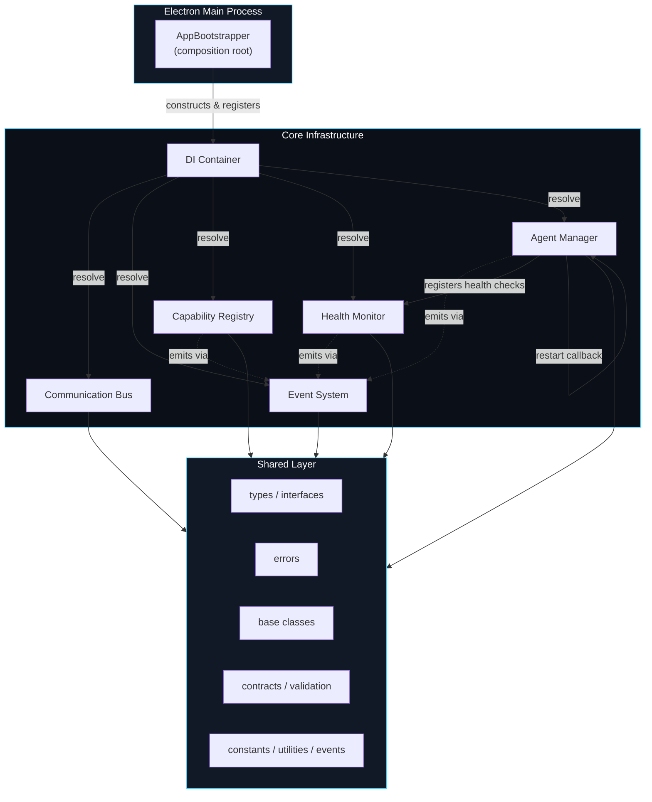
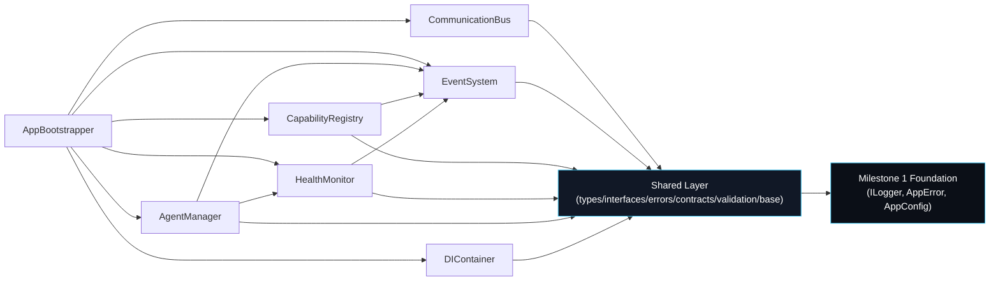
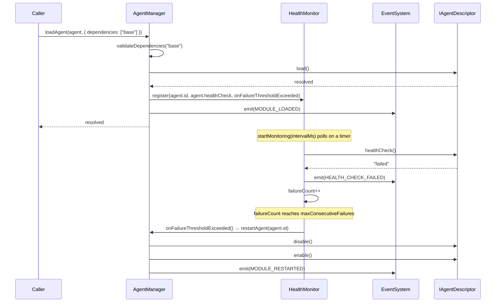

# Core Infrastructure — Diagrams

Mermaid source, renders directly on GitHub/GitLab or any Mermaid-aware
Markdown viewer.

## Architecture Diagram

Component view: the composition root wires the DI Container, which
constructs the five infrastructure singletons on top of the Shared
Layer.

## Dependency Diagram

Import-direction view: arrows point from a module to what it depends on.
Everything ultimately depends on the Shared Layer; nothing in Shared
depends back on infrastructure.

Notes:
- `CommunicationBus` has no dependency on `EventSystem`, `HealthMonitor`,
  or `AgentManager` — it is the one module usable in complete isolation.
- `EventSystem` is a dependency of three other infrastructure modules but
  depends on none of them — an intentional low-level/leaf position.

## Sequence Diagram

Example flow: loading an agent with a dependency, wiring it into the
Health Monitor, and reacting to a health-check failure with an automatic
restart — all infrastructure, no agent behavior implied.

