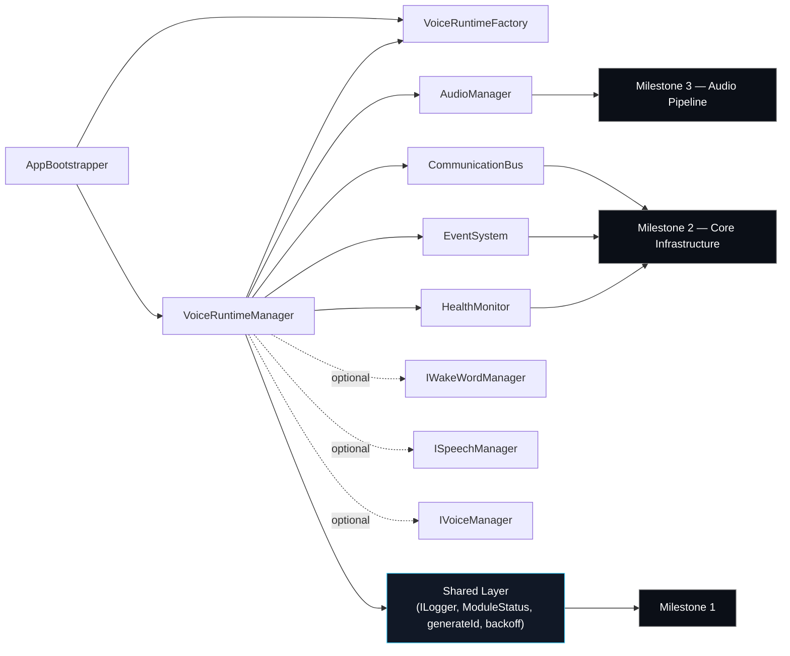
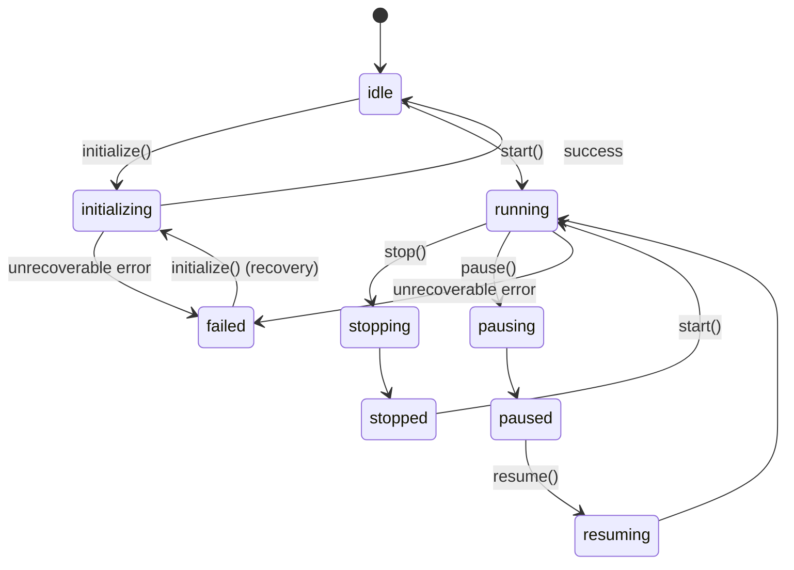

# Voice Runtime Framework

> **Status:** runtime orchestration only. No AI Brain, intent detection,
> command execution, Windows/browser automation, vision, memory, or
> coding agent exists anywhere in this milestone.

## Note on prior milestones

As with the Audio Pipeline Architecture milestone, this milestone's
instructions describe Milestones 3.1 (Voice Provider Architecture), 3.2
(Speech-to-Text Architecture), 3.3 (Wake Word Architecture), and 3.4
(Audio Pipeline Architecture) as already "LOCKED." **No file was
uploaded with this request at all** — this was built continuing from
this session's own in-progress workspace, which contains Milestone 1
(Foundation), Milestone 2 (Core Infrastructure), and Milestone 3 (Audio
Pipeline Architecture, delivered as "Milestone 3" in this session, not
subdivided into 3.1–3.4). There is no `WakeWordManager`, `SpeechManager`,
or `VoiceManager` implementation anywhere in the project — only the
`app/voice/` placeholder from Milestone 1, untouched.

Rather than fabricating three prior milestones' worth of provider code
to satisfy the framing, the Voice Runtime Framework was built to connect
**whatever providers are supplied** — including zero of them. See
"Operating with providers absent" below for what that means concretely.

## Placement

`app/backend/src/voice-runtime/`, following the same precedent as
`infrastructure/` (Milestone 2) and `audio/` (Milestone 3). `app/voice/`
remains completely untouched.

```
app/backend/src/voice-runtime/
├── types/             VoiceRuntimeState, VoiceSessionState, VoiceSubsystemName
├── errors/            VoiceRuntimeError hierarchy (extends Milestone 1's AppError)
├── interfaces/
│   ├── IWakeWordManager.ts   contract only — no wake-word engine
│   ├── ISpeechManager.ts     contract only — no STT engine
│   ├── IVoiceManager.ts      contract only — no TTS engine
│   ├── IVoiceSession.ts
│   ├── IVoiceRuntimeFactory.ts
│   └── IVoiceRuntimeManager.ts
├── models/            VoiceSession (concrete)
├── events/            VOICE_RUNTIME_EVENTS catalog
├── VoiceRuntimeConfig.ts
├── VoiceRuntimeFactory.ts
├── VoiceRuntimeManager.ts
└── tokens.ts           VOICE_RUNTIME_TOKENS (DI Container injection tokens)
```

## What "Connect" means here

The instructions ask this milestone to **connect** `AudioManager`,
`WakeWordManager`, `SpeechManager`, `VoiceManager`, the Communication
Bus, the Event System, the Health Monitor, Configuration, and Logging.
Concretely:

| Connected to | How |
|---|---|
| `AudioManager` (Milestone 3, always present) | `VoiceRuntimeManager` correlates each `VoiceSession` with an optional `audioSessionId`; ending a voice session best-effort ends its audio session too |
| `WakeWordManager` (interface only — absent) | `VoiceRuntimeManager` accepts it as an *optional* constructor dependency; when present, subscribes to `onWakeWordDetected` and calls `startListening()`/`stopListening()` during lifecycle transitions |
| `SpeechManager` (interface only — absent) | Same pattern: optional dependency, subscribes to `onSpeechStarted`/`onSpeechFinished`/`onSpeechRecognized` when present |
| `VoiceManager` (interface only — absent) | Same pattern: optional dependency, subscribes to `onVoiceResponseReady` when present |
| Communication Bus (Milestone 2) | A `voice-runtime.control` channel accepts `{ action: 'start'\|'stop'\|'pause'\|'resume' }` commands and responds with `{ state }` or `{ error }` |
| Event System (Milestone 2) | Every runtime event (see `VOICE_RUNTIME_EVENTS.md`) is emitted here — no new event engine |
| Health Monitor (Milestone 2) | One health check registered per connected subsystem (`voice-runtime:audio`, `:wake-word`, `:speech`, `:voice`); a subsystem's `onFailureThresholdExceeded` callback logs and emits an `ERROR` event |
| Configuration Manager | `AppConfig.voiceRuntime` (session timeout, retry count, backoff) — schema extended, mechanism untouched |
| Logging | Every method takes `ILogger` via constructor; zero `console.*` calls |

## Operating with providers absent

`VoiceRuntimeManagerDependencies.wakeWordManager` /
`.speechManager` / `.voiceManager` are all optional. In the wiring
performed by `AppBootstrapper` today, **none of the three are supplied**
— because none exist. This is not a placeholder mode the runtime falls
back to; it is a fully exercised code path:

- `initialize()` only registers health checks for subsystems that are
  actually present; absent ones report `'stopped'` from
  `getRuntimeHealth()`.
- `start()`/`pause()`/`resume()` only call into `wakeWordManager` if one
  was supplied — with none supplied, these transitions are pure state
  changes.
- `startVoiceSession()` can still be called directly (e.g., by a future
  UI or test) even with no wake-word detector to trigger it
  automatically.

When a future milestone implements a real `IWakeWordManager` (etc.), the
only change required is passing a concrete instance into
`VoiceRuntimeManagerDependencies` in `AppBootstrapper.ts` — no change to
`VoiceRuntimeManager` itself.

## VoiceRuntimeManager responsibilities

| Responsibility | Method(s) |
|---|---|
| Initialize Voice Stack | `initialize()` |
| Start runtime | `start()` |
| Stop runtime | `stop()` (graceful — ends active sessions, stops listening, tolerates provider errors) |
| Pause | `pause()` |
| Resume | `resume()` |
| Health monitoring | `getRuntimeHealth()` |
| Session lifecycle | `startVoiceSession`, `endVoiceSession`, `getVoiceSession`, `listVoiceSessions` |
| Runtime statistics | `getStatistics()` |
| Error recovery | `retrySubsystemOperation()` (internal) + `handleSubsystemFailure()` (internal) |

## Performance notes

- **Fast startup / low CPU/RAM**: `initialize()` does no polling of its
  own — it registers callbacks with the *existing* Health Monitor
  (already running its own interval from Milestone 2/3) rather than
  starting a second timer loop. Session timeout timers use
  `timer.unref?.()` so they never keep the Node.js process alive.
  `initialize()` does no I/O.
- **Background execution**: nothing in this module touches the renderer
  or requires a visible window; `VoiceRuntimeManager` is constructed and
  initialized entirely in the Electron main process during
  `AppBootstrapper.start()`.
- **Future scalability**: subsystem connections are dependency-injected
  interfaces, not hardcoded classes — supporting multiple concurrent
  voice sessions (already tracked in a `Map`, not a single slot) or
  swapping in a pooled/clustered `IWakeWordManager` implementation later
  requires no change to `VoiceRuntimeManager`.

## Diagrams

### Architecture Diagram

```mermaid
graph TB
    subgraph VoiceRuntime["Voice Runtime Framework"]
        VRM["VoiceRuntimeManager"]
        VRF["VoiceRuntimeFactory"]
        VS["VoiceSession (per interaction)"]
    end

    subgraph Providers["Provider interfaces — none implemented"]
        WWM["IWakeWordManager"]
        SM["ISpeechManager"]
        VM["IVoiceManager"]
    end

    subgraph Existing["Milestones 2 + 3 (unmodified)"]
        AM["AudioManager"]
        CB["CommunicationBus"]
        ES["EventSystem"]
        HM["HealthMonitor"]
    end

    VRM -->|optional, if supplied| WWM
    VRM -->|optional, if supplied| SM
    VRM -->|optional, if supplied| VM
    VRM -->|correlates sessions with| AM
    VRM -->|control channel| CB
    VRM -->|emits all runtime events| ES
    VRM -->|registers health checks| HM
    VRM -->|creates sessions via| VRF

    style VoiceRuntime fill:#0b0f17,color:#ffffff,stroke:#3fd0ff
    style Providers fill:#111826,color:#888888,stroke:#555555,stroke-dasharray: 5 5
    style Existing fill:#111826,color:#ffffff,stroke:#888888
```



### Runtime Sequence Diagram

See [`VOICE_RUNTIME_EVENTS.md`](./VOICE_RUNTIME_EVENTS.md) for the full
event-by-event sequence diagram covering a complete wake-word-to-response
interaction (with fake providers, as exercised by the test suite).

### Dependency Diagram



### State Diagram



## Architecture Decision Records

### ADR-VOICE-001: Provider dependencies are optional, not stubbed

**Decision:** `IWakeWordManager`/`ISpeechManager`/`IVoiceManager` are
optional constructor parameters on `VoiceRuntimeManager`, not
mocked/no-op implementations that get registered in DI.

**Rationale:** No concrete implementation of any of the three exists.
Registering a fake "always succeeds, does nothing" implementation in the
DI Container would misrepresent the system's actual capability — a
health check would report "running" for a subsystem that doesn't exist.
Making the dependency genuinely optional and having `getRuntimeHealth()`
honestly report `'stopped'` for what isn't connected is more accurate
and, per the "do not implement AI Brain / wake word / STT / TTS"
constraint, the only honest option available.

**Consequences:** Any test or future caller must handle the "provider
absent" case explicitly (as this milestone's tests do) rather than
assuming a subsystem is always present.

### ADR-VOICE-002: Runtime control goes through the Communication Bus; runtime events go through the Event System

**Decision:** Starting/stopping/pausing/resuming the runtime from
outside the process is modeled as a command/response exchange
(`ICommunicationBus.sendCommand('voice-runtime.control', ...)`), while
the seven required runtime events (`WakeWordDetected` through `Errors`)
are modeled as fire-and-forget notifications (`IEventSystem.emit`).

**Rationale:** This mirrors the distinction already established in
`AUDIO_PIPELINE_ARCHITECTURE.md`'s ADR-AUDIO-001: control operations
that expect an acknowledgment belong on the bus; state notifications
that many listeners may want, with no reply expected, belong on the
event system. Using one bus for both would either force events to wait
for acknowledgment (unnecessary overhead) or force control commands to
have no confirmation (worse ergonomics for a future caller).

**Consequences:** A future UI wanting to show "is the mic listening"
should watch `STATE_CHANGED` events, not poll `sendCommand`.

### ADR-VOICE-003: Session timeout is inactivity-based, not fixed-duration

**Decision:** `VoiceSession.timeoutMs` resets every time a runtime event
touches the session (speech started, finished, recognized, response
ready) — it is not a fixed wall-clock deadline from session start.

**Rationale:** A real voice interaction has unpredictable duration (the
user could be mid-sentence when a fixed deadline would fire). Resetting
on activity means the timeout only fires when the *interaction itself*
has gone quiet — the correct signal for "the user walked away" or "the
speech provider stopped responding," matching the "Session Timeout"
requirement's intent (protecting against runaway/abandoned sessions, not
capping legitimate interaction length).

**Consequences:** A pathological provider that keeps emitting
`SpeechStarted` forever without ever finishing would never time out —
this is an accepted tradeoff for this architecture-only milestone; a
future milestone could add a secondary absolute cap if needed.
