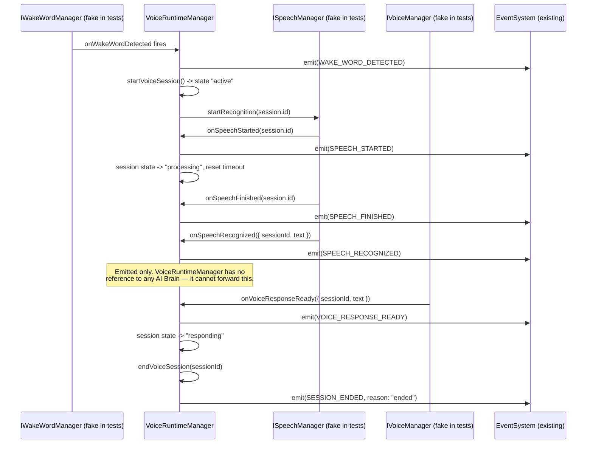

# Voice Runtime Events

The seven runtime events this milestone requires, plus one internal
housekeeping event (`STATE_CHANGED`), all emitted through the **existing**
Event System (Milestone 2) — no new event engine.

## Catalog

`app/backend/src/voice-runtime/events/voiceRuntimeEvents.ts`:

| Constant | Channel name | Category | Priority | Payload |
|---|---|---|---|---|
| `WAKE_WORD_DETECTED` | `voice.runtime.wake-word-detected` | `user` | `high` | `{ timestamp, deviceId }` |
| `SPEECH_STARTED` | `voice.runtime.speech-started` | `application` | `normal` | `{ sessionId }` |
| `SPEECH_FINISHED` | `voice.runtime.speech-finished` | `application` | `normal` | `{ sessionId }` |
| `SPEECH_RECOGNIZED` | `voice.runtime.speech-recognized` | `application` | `normal` | `{ sessionId, text, confidence }` |
| `VOICE_RESPONSE_READY` | `voice.runtime.voice-response-ready` | `application` | `normal` | `{ sessionId, text }` |
| `SESSION_ENDED` | `voice.runtime.session-ended` | `system` | `normal` | `{ sessionId, reason: 'ended' \| 'timeout' }` |
| `ERROR` | `voice.runtime.error` | `system` | `high`/`critical` | `{ subsystem, attempt?, error?, reason? }` |
| `STATE_CHANGED` | `voice.runtime.state-changed` | `system` | `low` | `{ state }` |

`STATE_CHANGED` isn't one of the seven explicitly requested events, but
every lifecycle method (`start`/`stop`/`pause`/`resume`/internal
transitions) emits it — it's the event a future UI would actually watch
to render runtime status, so it's included for completeness alongside
the seven.

## Subscribing to runtime events

Exactly like Milestone 2/3's event usage — no special API:

```ts
eventSystem.on(VOICE_RUNTIME_EVENTS.WAKE_WORD_DETECTED, (event) => {
  console.log('Wake word heard at', event.payload.timestamp);
});
```

## Full interaction sequence

The sequence below is exactly what `tests/voice-runtime/event-flow.test.ts`
exercises, using fake `IWakeWordManager`/`ISpeechManager`/`IVoiceManager`
implementations (no real providers exist):



## Error event triggers

`ERROR` is emitted from two distinct places — worth distinguishing:

1. **Per-attempt, during retry** (`priority: 'high'`) — every failed
   attempt inside `retrySubsystemOperation()` (see `VOICE_RUNTIME.md` →
   Error Handling) emits one `ERROR`, with `attempt` in the payload. If
   `maxRetryAttempts` is 3 and every attempt fails, expect three `ERROR`
   events before the operation ultimately throws
   `VoiceSubsystemError`.
2. **Health-threshold exceeded** (`priority: 'critical'`) — when the
   Health Monitor (Milestone 2) determines a connected subsystem has
   failed its health check `maxConsecutiveFailures` times in a row, its
   `onFailureThresholdExceeded` callback fires exactly once and emits a
   single `ERROR` with `reason: 'health-threshold-exceeded'`.

Both paths increment `VoiceRuntimeStatistics.errors` — `getStatistics()`
is the aggregate view; the `ERROR` event stream is the detailed view.

## Session-ended reasons

`SESSION_ENDED.payload.reason` is either:

- `'ended'` — `endVoiceSession()` was called explicitly (directly, or
  automatically after `VOICE_RESPONSE_READY`, or during `stop()`).
- `'timeout'` — the session's inactivity window elapsed with no touch
  (see `VOICE_SESSION_RUNTIME.md` for the full timeout mechanics).
